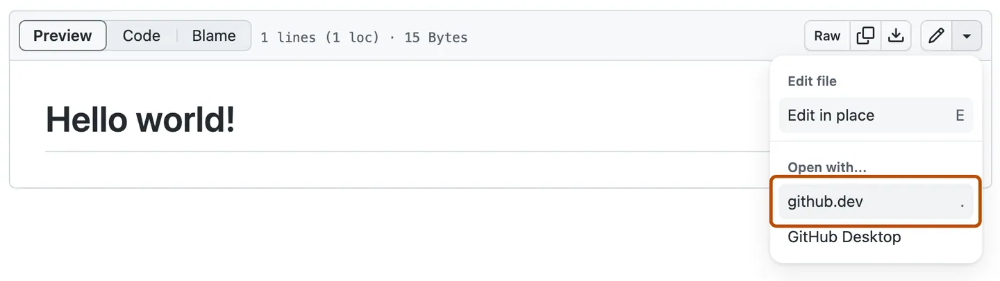

## 如何添加新内容

### 打开 github.dev 编辑器

+ 要在同一浏览器标签页中打开存储库，请按 `.` （在 GitHub 上浏览任何存储库或拉取请求时）。

+ 要在新的浏览器标签页中打开存储库，请按 `>`。

+ 将 URL 从“github.com”更改为“github.dev”。

+ 查看文件时，选择下拉菜单，然后单击“github.dev”。

### 添加成员的个人页面

1. 在 [`content\authors`](content\authors) 目录下新建以自己名字命名的目录，放入 `_index.md` （内容参照其他人） 和头像 `avatar.jpg` 或 `avatar.png` （最好是正方形）。
2. 修改 `_index.md` 中的内容为自己的。其中 `user_groups` 字段从 [`content\team\index.md`](content\team\index.md) 中的 `user_groups` 选择。
3. 提交修改。

### 添加新发表的论文

1. 导出论文的Bibtex格式的引用，添加到 [`publications.bib`](publications.bib) 中，提交修改。
2. 等待 [Import Publications From Bibtex](https://github.com/LDU-IIPLab/LDU-IIPLab.github.io/actions/workflows/import-publications.yml) 流程完成后，github-actions bot 会发起一个 pull request 以导入新的论文。管理员同意后，新的论文将提交为[`content\publication`](content\publication)目录下的一个文件夹（文件夹名为其导出的Bibtex中的引用标记）。
3. 检查文件夹中的 `index.md` 文件，修改其中的内容：
    - 修改 `authors` 中的中文姓名为其对应的英文姓名以实现作者主页对应。
    - 修正 `date` 字段为正确的发表时间
    - 已正式发表的论文应添加 `doi` 字段
    - 如果论文公开了源代码，应添加 `url_code` 字段，指向源代码仓库（可参照  [`content\publication\sheng-2024-lightweight\index.md`](content\publication\sheng-2024-lightweight\index.md) 修改）。
    - 如果论文公开了数据集，应添加 `url_dataset` 字段，指向数据集。
    - 如果论文有可在线获取的 pdf，应添加 `url_pdf` 字段，指向 pdf 链接。或直接将 pdf 文件放入文件夹中，与文件夹同名。
4. 提交修改。

### 添加新闻

1. 在 [`content\news`](content\news) 目录下新建以新闻日期命名的目录，放入 `index.md` （内容参照其他新闻）。
2. 修改 `index.md` 中的 `title` 、`date` 以及 `新闻内容（markdown格式，图片途径为相对于此新闻目录的相对路径）`
3. 在此目录下放入命名为 `featured` 的图片作为新闻的封面。
4. 提交修改。
