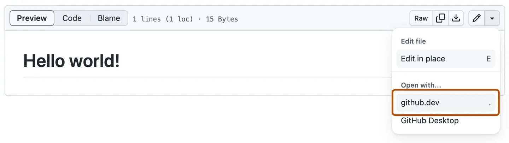

# Information Processing Laboratory
这是鲁东大学智能信息处理实验室的主页源代码仓库。

## 如何添加新内容

### 打开 github.dev 编辑器

+ 要在同一浏览器标签页中打开存储库，请按 `.` （在 GitHub 上浏览任何存储库或拉取请求时）。

+ 要在新的浏览器标签页中打开存储库，请按 `>`。

+ 将 URL 从“github.com”更改为“github.dev”。

+ 查看文件时，选择下拉菜单，然后单击“github.dev”。

### 添加自己的个人页面

1. 在 `content\authors` 目录下新建以自己名字命名的目录，放入 `_index.md`（内容参照其他人）和头像 `avatar.jpg` 或 `avatar.png`（最好是正方形）。
2. 修改`_index.md`中的内容为自己的。其中`user_groups`字段从 `content\team\index.md`中的`user_groups`选择。
3. 修改完成后提交即可。
