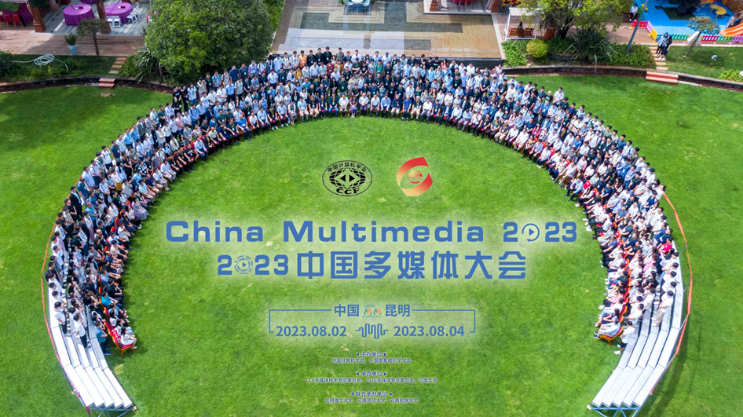

2023年8月2-4日由中国计算机学会（CCF）、中国图象图形学学会（CSIG）主办，CCF多媒体技术专业委员会、CSIG多媒体专业委员会、云南大学承办，昆明理工大学、云南师范大学和云南民族大学联合承办的中国多媒体大会（ChinaMM 2023）在云南省昆明市成功举办。大会包含4个大会主旨报告，1场企业特邀报告，2个讲习班，15个论坛，多场创新成果展等，团队盛国瑞老师带领两位研究生前往参加进行学术交流。
下午，两位老师分别对实验室成员进行了科研学习指导。

 
