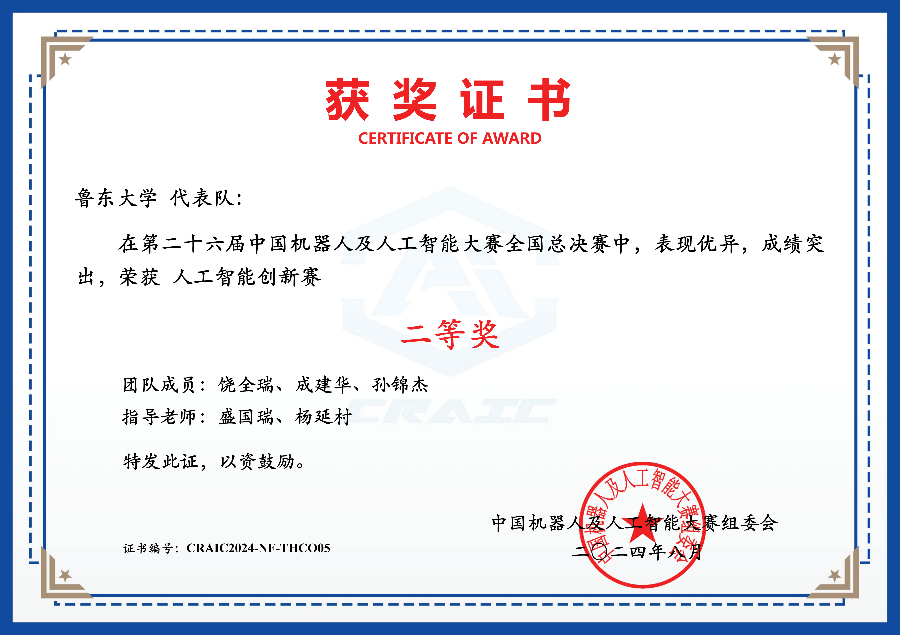
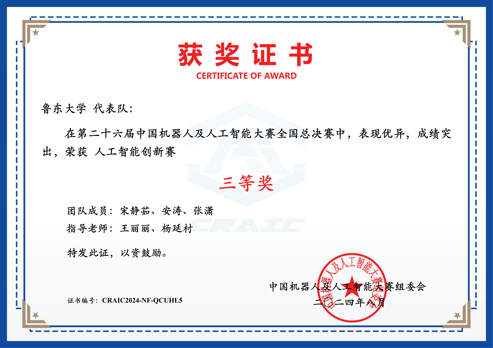
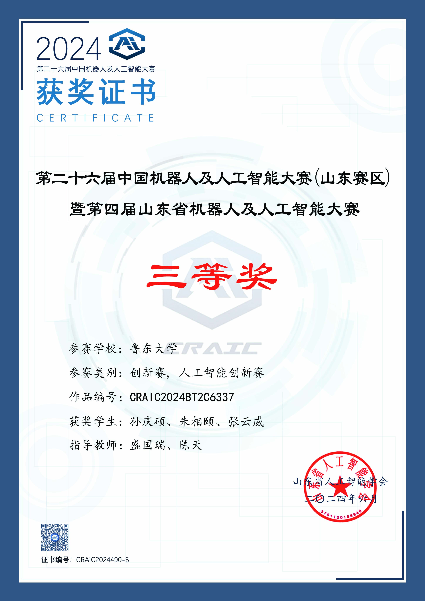

2024年8月25日，第二十六届中国机器人及人工智能大赛全国决赛(宜兴)圆满结束。鲁东大学信息与电气工程学院学生代表队在本次比赛的人工智能创新赛中表现优异，荣获国家级二等奖一项、国家级三等奖两项、省赛区三等奖一项的荣誉。 

<!--more-->

本次大赛由中国机器人及人工智能大赛组委会、江苏省宜兴市人民政府主办,宜兴陶都科技新城发展有限公司、苏州大学机电工程学院、苏州大闹天宫机器人科技有限公司、乐聚(深圳)机器人技术有限公司、宜兴市大数据发展有限公司联合承办。大赛吸引了来自清华大学、哈尔滨工业大学、浙江大学、国防科技大学、北京航空航天大学、北京理工大学、同济大学、华中科技大学等208所高校的407支队伍、1300余名选手参赛，围绕自动驾驶、机器人、人工智能等领域的前沿技术应用与实践进行技术交流、切磋并展开激烈对决。超200位机器人与人工智能领域的专家学者、行业精英齐聚一堂,共同探讨机器人与人工智能领域前沿技术和应用落地。

