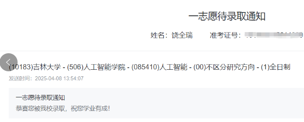

近日，鲁东大学智能信息处理实验室2024届本科毕业生考研录取结果揭晓，实验室人才培养再结硕果。四名大四成员凭借扎实的专业基础和突出的科研能力，成功考取国内知名高校研究生，展现了实验室在智能信息领域高质量育人成效。

<!--more-->

饶全瑞同学以优异成绩被吉林大学（国家“双一流”A类高校）人工智能专业录取；

孙锦杰同学成功考取北京邮电大学（信息科技领域顶尖学府）人工智能方向研究生；
成建华、安涛两位同学双双进入南京信息工程大学（大气科学与信息工程特色高校）人工智能专业深造。

实验室始终秉持“创新引领、实践育人”理念，通过科研项目驱动、导师-研究生-本科生传帮带等机制，全面提升学生专业素养与科研能力。近年来，实验室毕业生升学率持续攀升，多名学子进入985/211院校及科研院所深造，印证了实验室在智能信息处理领域人才培养的显著成效。
