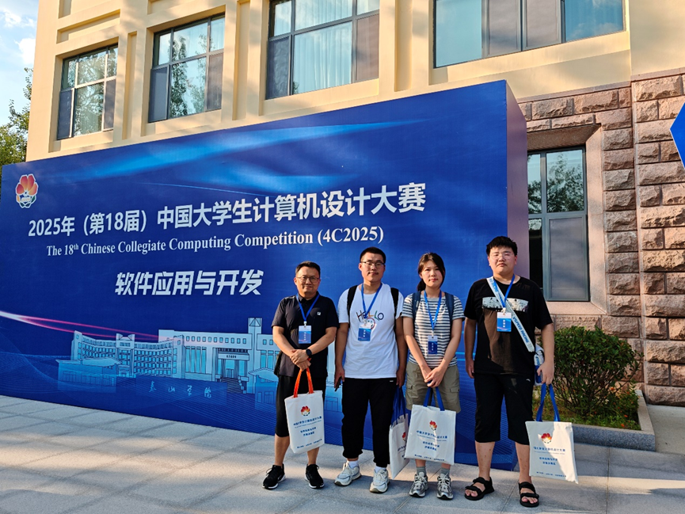

近日，我实验室本科生同学在暑假期间多项全国性科技竞赛中表现优异，连创佳绩，共斩获三项国家级大奖，彰显了实验室在人工智能与计算机视觉应用领域的深厚培养底蕴和学生的卓越创新能力。

<!--more-->

在备受瞩目的睿抗机器人大赛全国总决赛中，由22级软件工程专业李云鹏同学率领的队伍（队员：付统宇、孟浩文、王商梓涵、巩浩钰）凭借项目《智膳图谱——计算机视觉驱动的精准营养评估与个性化膳食方案》荣获全国三等奖。该项目巧妙地将计算机视觉技术应用于健康膳食领域，展现了强大的工程实现能力与人文关怀。

第27届中国机器人与人工智能大赛中，23级人工智能专业王商梓涵同学作为队长（队员：孟浩文、谢圣智），其项目《“果识特工”：高效视觉Transformer在果蔬识别中的结构化建模探索》同样荣获全国三等奖。该项目聚焦于前沿Transformer模型的结构化优化，体现了同学们对学术前沿的敏锐洞察和扎实的科研探索精神。

中国大学生计算机设计大赛中，22级软件工程专业李云鹏同学再次率队（队员：张文莉、盛瑛楠、吕聪睿），以项目《秒食鉴：一款搭载双路特征聚合架构的高效食品识别APP》拿下全国三等奖。该项目着眼于移动端应用落地，其设计的轻量化模型架构具有良好的实用价值。

三项国家级奖项的取得，不仅是对获奖同学们辛勤付出与卓越才华的充分肯定，也充分体现了实验室在人才培养和创新实践方面取得的显著成效。

