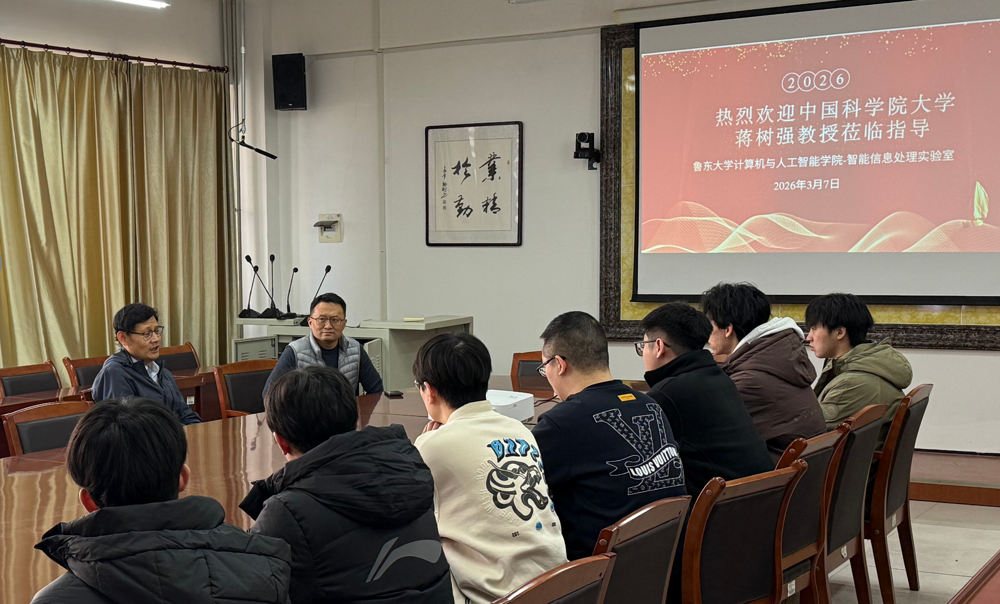
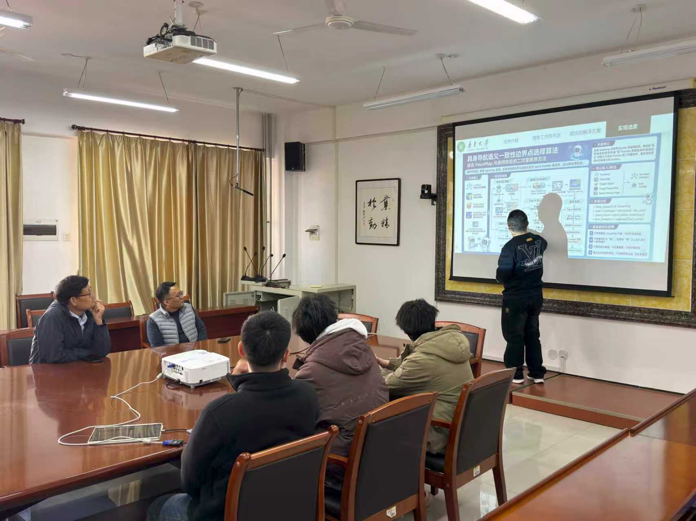

2026年3月7日，中国科学院大学蒋树强教授在百忙之中莅临鲁东大学智能信息处理实验室，与实验室师生进行了一次简短而高效的学术交流。

<!--more-->

会上，蒋树强教授首先听取了实验室近期科研工作进展的简要汇报。他对实验室近期取得的丰硕研究成果，特别是多篇高水平学术论文的连续发表表示了热烈的祝贺与肯定。

在随后的交流环节中，蒋老师针对同学们在具体科研项目中遇到的难点进行了精准解答。尽管时间紧凑，他依然凭借丰富的经验直击问题核心，为同学们梳理了清晰的解决思路。

最后，蒋老师勉励在座的研究生们继续保持扎实严谨的科研作风，再接再厉，力争在接下来的研究中取得更大的突破。